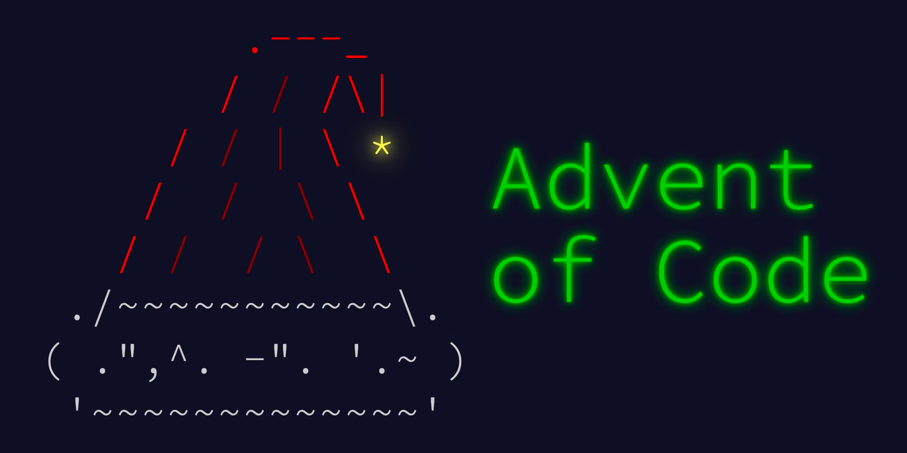

# Advent of Code 2022

Traduções para Português e implementação das soluções do AoC2022



## Descrição

Soluções do https://adventofcode.com/2022 feitas em Go.
As traduções dos enunciados estão disponíveis dentro de cada dia.

## Soluções e tempos

`go run .`

<!-- ci:result:start -->
```
######################################################
Resolvendo os puzzles do https://adventofcode.com/2022
######################################################

 Dia | Parte 1    ( time ms ) | Parte 2    ( time ms ) |
-----+------------------------+------------------------+
  01 | 72017      (      0.2) | 212520     (      0.2) | 
  02 | 14827      (      0.2) | 13889      (      0.2) | 
```
<!-- ci:result:end -->